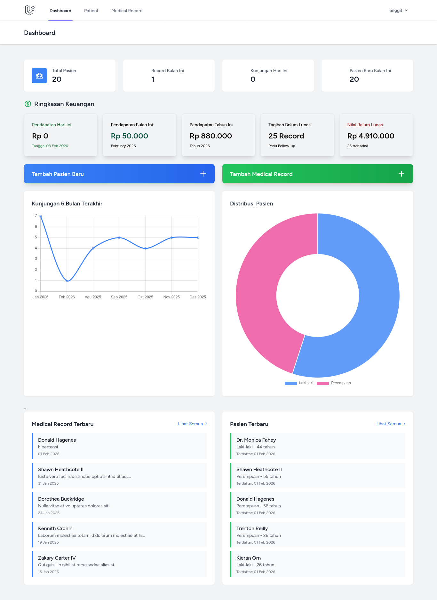
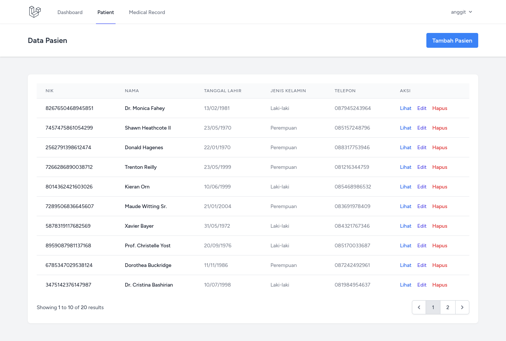
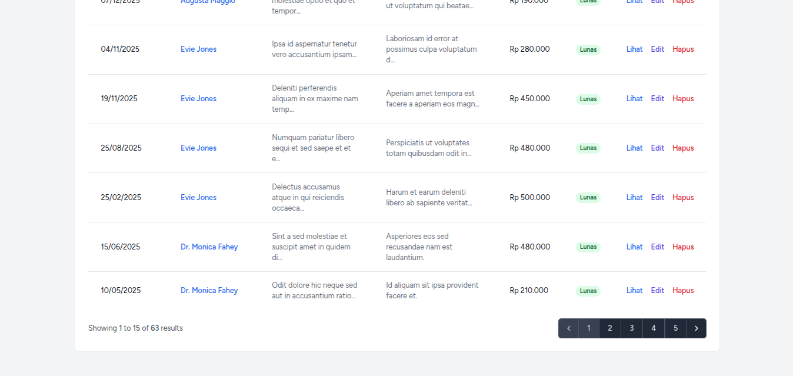
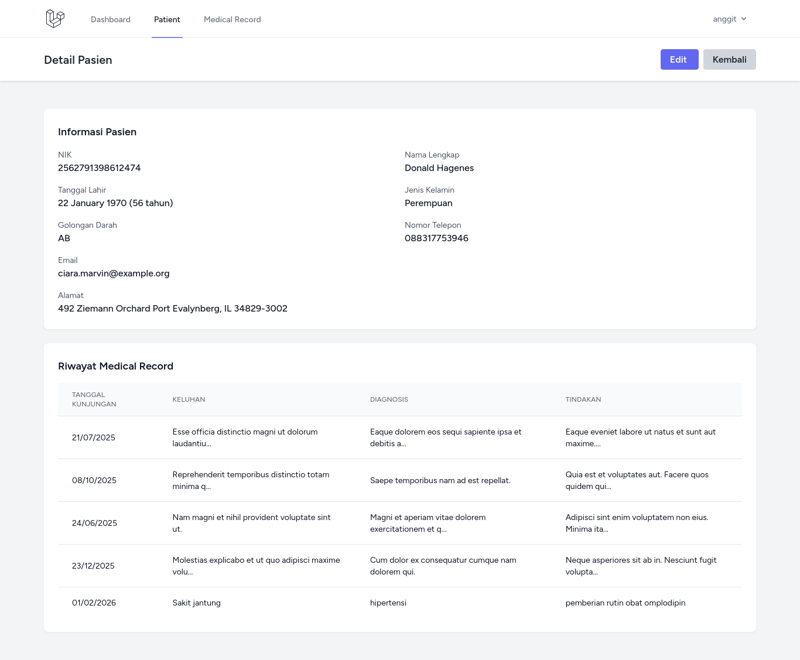

# Medical Record Information System (MRIS)


## 📋 Deskripsi

**Medical Record Information System (MRIS)** adalah sistem informasi manajemen rekam medis berbasis web yang didesain khusus untuk klinik kecil dengan 1 dokter. Aplikasi ini membantu mengelola data pasien, catatan rekam medis, dan laporan keuangan klinik secara digital dan terstruktur.

### ✨ Fitur Utama

- 🏥 **Manajemen Data Pasien**
  - CRUD (Create, Read, Update, Delete) data pasien
  - Pencarian dan filter pasien
  - Riwayat kunjungan per pasien
  - Data lengkap: NIK, nama, tanggal lahir, gender, alamat, telepon, email, golongan darah

- 📝 **Rekam Medis Digital**
  - Pencatatan kunjungan pasien
  - Keluhan, diagnosis, dan tindakan
  - Resep obat dan catatan tambahan
  - Select pasien yang searchable (mudah mencari dari ribuan data)

- 💰 **Manajemen Keuangan**
  - Pencatatan pembayaran per kunjungan
  - Status pembayaran (Lunas/Belum Lunas)
  - Laporan pendapatan harian, bulanan, dan tahunan
  - Dashboard keuangan real-time

- 📊 **Dashboard Informatif**
  - Statistik kunjungan dan pasien
  - Grafik kunjungan 6 bulan terakhir
  - Distribusi pasien berdasarkan gender
  - Top 5 diagnosis terbanyak
  - Financial summary (pendapatan hari ini, bulan ini, tahun ini)
  - Daftar pasien dan rekam medis terbaru

- 🔐 **Keamanan**
  - Authentication (Login/Logout)
  - Password Reset via Email
  - Protected routes dengan middleware
  - Validasi data yang ketat

---

## 🖼️ Screenshots

### Dashboard

*Dashboard dengan statistik lengkap dan grafik*

### Data Pasien

*Daftar pasien dengan pagination*

### Rekam Medis

*Manajemen rekam medis pasien*

### Detail Pasien

*Detail informasi pasien dan riwayat kunjungan*

---

## 🛠️ Tech Stack

- **Backend**: Laravel 11.x
- **Frontend**: Blade Templates + TailwindCSS
- **Database**: MySQL/MariaDB
- **Authentication**: Laravel Breeze
- **Charts**: Chart.js
- **PHP**: 8.2+
- **Package Manager**: Composer, NPM

### Langkah Instalasi

#### 1. Clone Repository
```bash
git clone https://github.com/AnggitSeptiansyah/medical-record-information-system.git
cd medical-record
```

#### 2. Install Dependencies
```bash
# Install PHP dependencies
composer install

# Install JavaScript dependencies
npm install
```

#### 3. Environment Setup
```bash
# Copy file .env
cp .env.example .env

# Generate application key
php artisan key:generate
```

#### 4. Konfigurasi Database

Edit file `.env`:
```env
DB_CONNECTION=mysql
DB_HOST=127.0.0.1
DB_PORT=3306
DB_DATABASE=medical_record
DB_USERNAME=your_db_username
DB_PASSWORD=your_password
```

Buat database:
```bash
mysql -u root -p
```
```sql
CREATE DATABASE medical_record;
EXIT;
```

